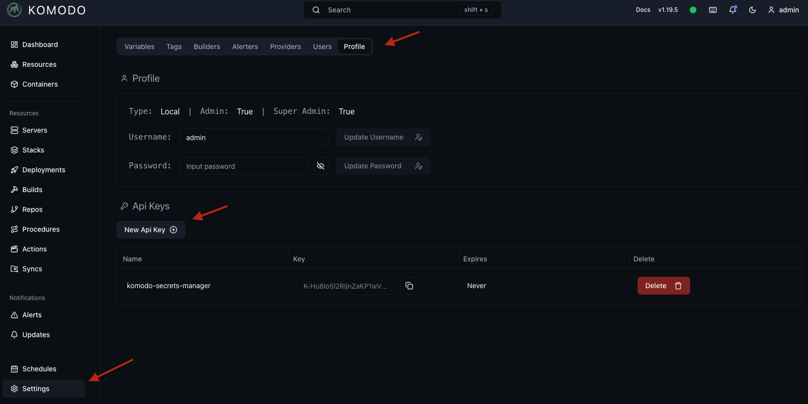

# Komodo Secrets Sync

Sync secrets from a secrets manager into [Komodo](https://github.com/moghtech/komodo) (Currently supports [Bitwarden Secrets Manager](https://bitwarden.com/products/secrets-manager/))

> **Why?** [Komodo](https://github.com/moghtech/komodo) doesn't natively support fetching secrets from external secrets managers. If you manage your Docker Compose stacks in a GitOps workflow and want to automatically sync secrets from external secrets managers (like HashiCorp Vault, Bitwarden Secrets Manager, etc.) to Komodo, this tool is for you! (Alternatively, you can add secrets manually in the Komodo UI 😉)


## Features

- Continuously monitors and syncs secrets at configurable intervals
- Detects changes using hashing (SHA-256)
- Only syncs modified secrets, not everything

## Supported Secret Managers

| Secret Manager                                                               | Status       |
| ---------------------------------------------------------------------------- | ------------ |
| [Bitwarden Secrets Manager](https://bitwarden.com/products/secrets-manager/) | ✅ Supported |
| [HashiCorp Vault](https://www.vaultproject.io/)                              | 🚧 Planned   |

## Quick Start

### Usage

```
Usage: komodo-secrets-sync --komodo-url=STRING --komodo-api-key=STRING --komodo-api-secret=STRING <command> [flags]

Sync secrets from a secrets manager into Komodo.

Flags:
  -h, --help                        Show context-sensitive help.
      --komodo-url=STRING           Komodo URL ($KOMODO_URL)
      --komodo-api-key=STRING       Komodo API key ($KOMODO_API_KEY)
      --komodo-api-secret=STRING    Komodo API secret ($KOMODO_API_SECRET)
      --reconciler-interval=5m      Reconcile interval ($RECONCILER_INTERVAL)
      --log-format="json"           Set the output format of the logs. Must be "console" or "json" ($LOG_FORMAT).
      --log-level=INFO              Set the log level. Must be "DEBUG", "INFO", "WARN" or "ERROR" ($LOG_LEVEL).
      --log-add-source              Whether to add source file and line number to log records ($LOG_ADD_SOURCE).
      --version                     Print version information and exit

Secret Managers
  bitwarden    Bitwarden Secrets Manager.

Run "komodo-secrets-sync <command> --help" for more information on a command.
```

### Get Komodo API Access Key

1. Go to Komodo UI → **Settings**
2. Click on **Profile** tab
3. Create API keys as shown below:



### Get Your Secret Manager Access Tokens

This tool currently supports **Bitwarden Secrets Manager**. Follow the setup guide to get your access tokens:

- **[Bitwarden Setup Guide](./docs/Bitwarden.md)**

### Docker Compose Deployment

Export environment variables with your credentials:

```bash
export KOMODO_API_KEY=REDACTED
export KOMODO_API_SECRET=REDACTED
export KOMODO_URL=KOMODO_URL
export ACCESS_TOKEN=REDACTED
export PROJECT_ID=REDACTED
export ORGANIZATION_ID=REDACTED
```

```yaml
---
name: komodo-secrets-sync
services:
  komodo-secrets-sync:
    image: veerendra2/komodo-secrets-sync:latest
    container_name: komodo-secrets-sync
    environment:
      # Komodo Configuration
      KOMODO_API_KEY: ${KOMODO_API_KEY}
      KOMODO_API_SECRET: ${KOMODO_API_SECRET}
      KOMODO_URL: ${KOMODO_URL}

      # Bitwarden Secrets Manager Configuration
      BW_ACCESS_TOKEN: ${BW_ACCESS_TOKEN}
      BW_ORGANIZATION_ID: ${BW_ORGANIZATION_ID}
      BW_PROJECT_ID: ${BW_PROJECT_ID}
    command:
      - bitwarden
    restart: unless-stopped
    hostname: komodo-secrets-sync
```

## Build & Test

- Using [Taskfile](https://taskfile.dev/)

_Install Taskfile: [Installation Guide](https://taskfile.dev/docs/installation)_

```bash
# Available tasks
task --list
task: Available tasks for this project:
* all:                   Run comprehensive checks: format, lint, security and test
* build:                 Build the application binary for the current platform
* build-docker:          Build Docker image
* build-platforms:       Build the application binaries for multiple platforms and architectures
* fmt:                   Formats all Go source files
* install:               Install required tools and dependencies
* lint:                  Run static analysis and code linting using golangci-lint
* run:                   Runs the main application
* security:              Run security vulnerability scan
* test:                  Runs all tests in the project      (aliases: tests)
* vet:                   Examines Go source code and reports suspicious constructs
```

- Build with [goreleaser](https://goreleaser.com/)

_Install GoReleaser: [Installation Guide](https://goreleaser.com/install/)_

```bash
# Build locally
goreleaser release --snapshot --clean
...
```
