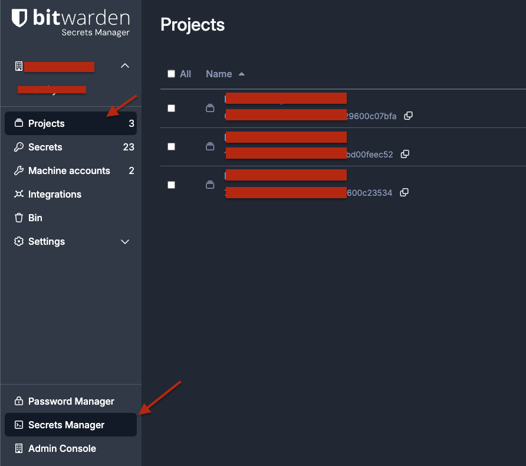
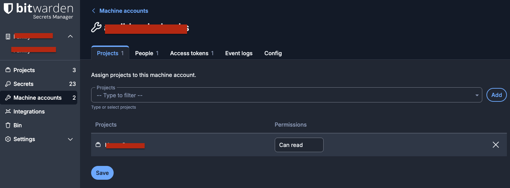
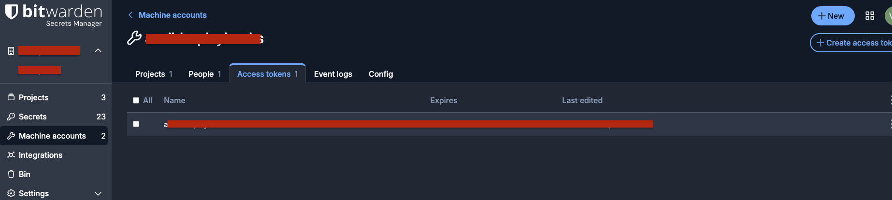
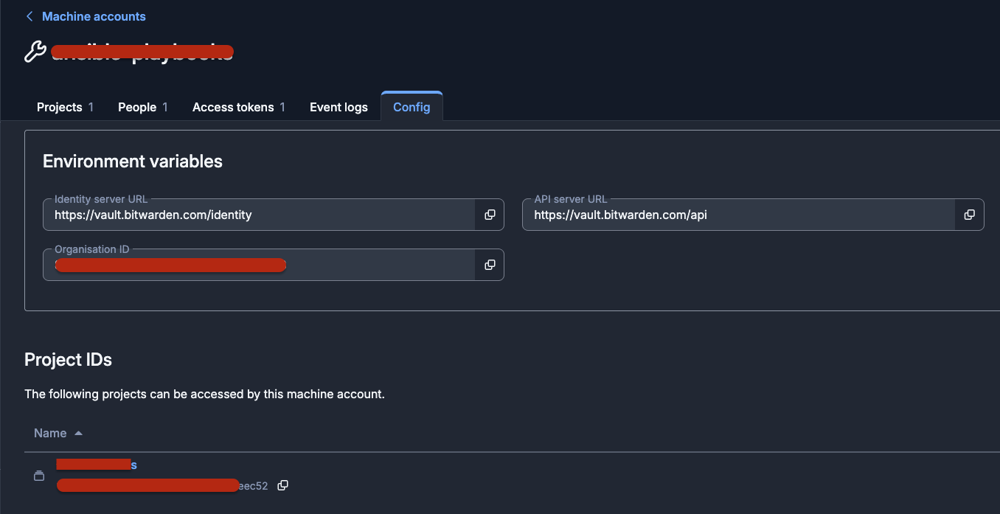

# Bitwarden Secrets Manager Setup

This guide shows you how to configure komodo-secrets-injector with Bitwarden Secrets Manager.

> For more information, check [Secrets Manager Overview](https://bitwarden.com/help/secrets-manager-overview/)

## Prerequisites

- Bitwarden account with Secrets Manager enabled
- Komodo API credentials (see [README](../README.md#get-komodo-api-access-key))

## Setup Steps

### Create a Project

1. Login to your Bitwarden account
2. Navigate to **Secrets Manager**
3. Click **New Project** and give it a meaningful name (e.g., `komodo-production`)
4. Add your secrets to this project



### Create a Machine Account

1. In Secrets Manager, go to **Machine Accounts**
2. Click **New Machine Account**
3. Assign the project you created above
4. Set permission to **Can read**
5. Click **Save**



### Generate Access Token

1. In the Machine Account details, go to **Access tokens** tab
2. Click **Create access token**
3. Give it a descriptive name (e.g., `komodo-sync-token`)
4. **Copy and save the token immediately** - you won't be able to see it again!



### Get Configuration Details

Click on **Settings** icon to get:

- **Organization ID**
- **Project ID**
- **API URL** (default: `vault.bitwarden.com/api`)
- **Identity URL** (default: `vault.bitwarden.com/identity`)



## Configuration

### Environment Variables

Export the following environment variables:

```bash
export BW_ACCESS_TOKEN=<your-access-token>
export BW_ORGANIZATION_ID=<your-org-id>
export BW_PROJECT_ID=<your-project-id>

# Optional: Only needed for self-hosted Bitwarden
export BW_API_URL=vault.bitwarden.com/api
export BW_IDENTITY_URL=vault.bitwarden.com/identity
```
